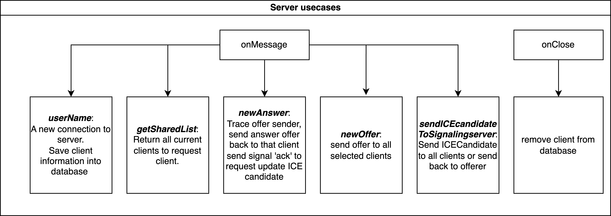

# webRTCDemo
Given two devices, A and B, for enabling the sharing of streaming video from device A to device B. Let A be the host user who will share its video with client device B.
To solve this problem, we use WebRTC combined with WebSocket as the key to this implementation.

As shown in figure systematic of wertc, we define the steps of connectivity and streaming as belows:
1. Hosts and clients connect to the WebSocket server.
2. The host sends an offer to share streaming data with clients via the WebSocket server.
3. The WebSocket server notifies all connected clients of available offers.
4. Subsequently, when a client accepts to display streaming data, it sends an answer offer to the WebSocket server to establish a peer-to-peer connection and begins displaying the streaming data.

# Server events:
To handle the supportive server, we design a local websocket server listens on port 8282 with as below events:

# UI
1. host:

2. client:

# How to use
1. install envs:
This code was test on Nodejs v20.11.1

2. Run local server
npm run start

3. change address of host and client
const ws = new WebSocket('ws://your ip address:8282');
example: const ws = new WebSocket('ws://192.168.55.106:8282');

4. Opend host on: http://your ip address:8282/index.html

5. Opend client on: http://your ip address:8282/indexs.html

